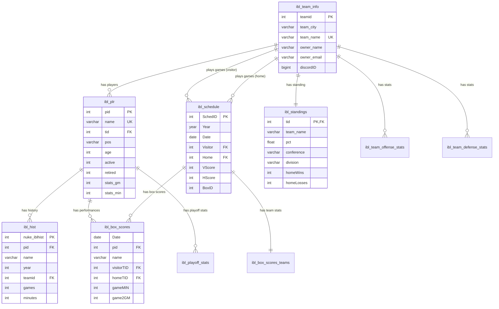
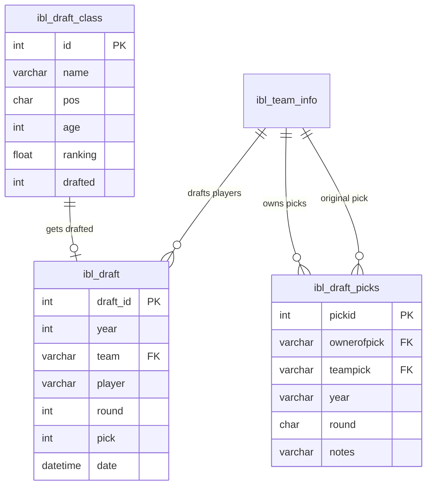
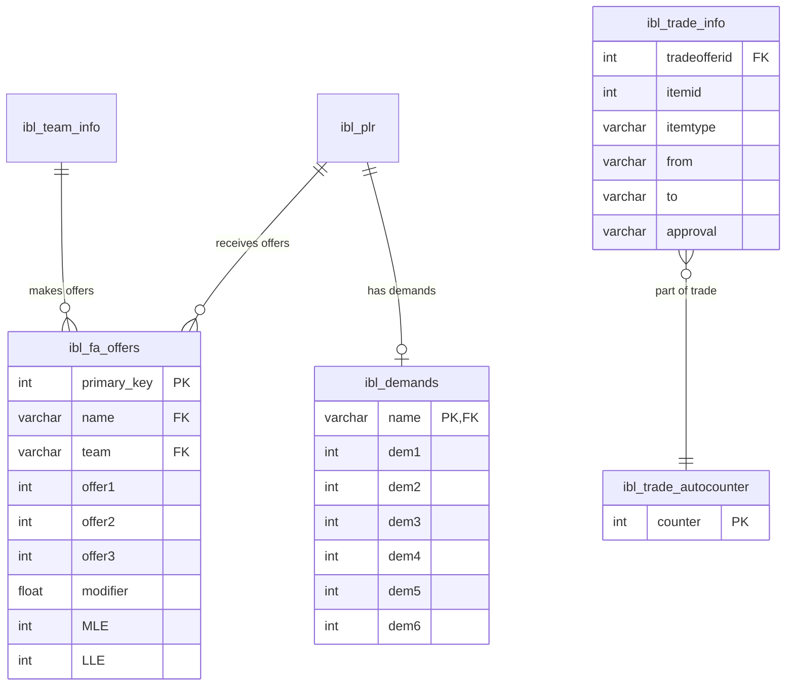
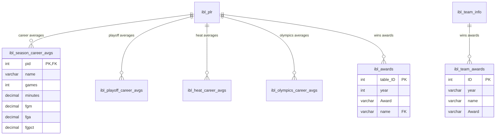
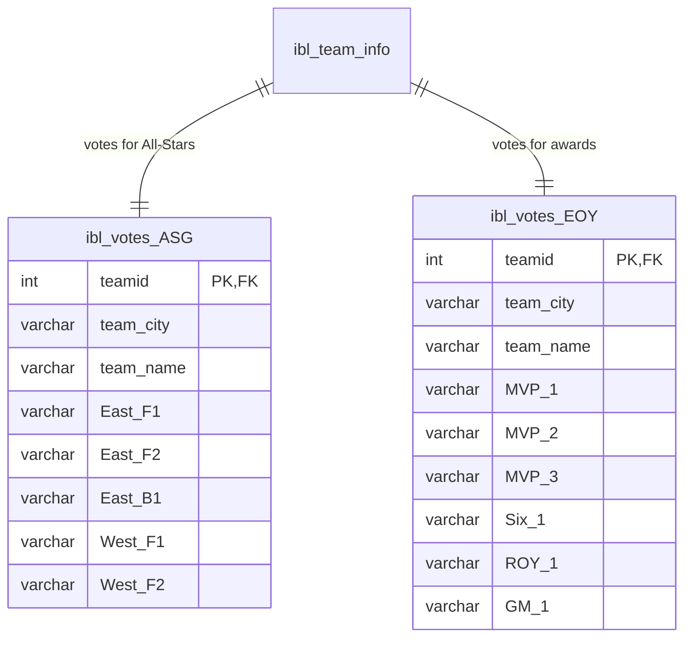
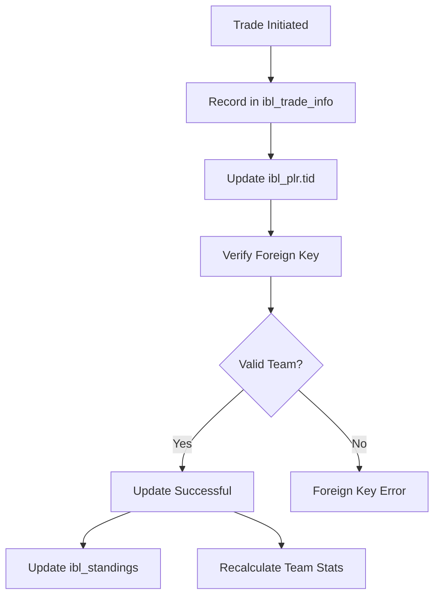
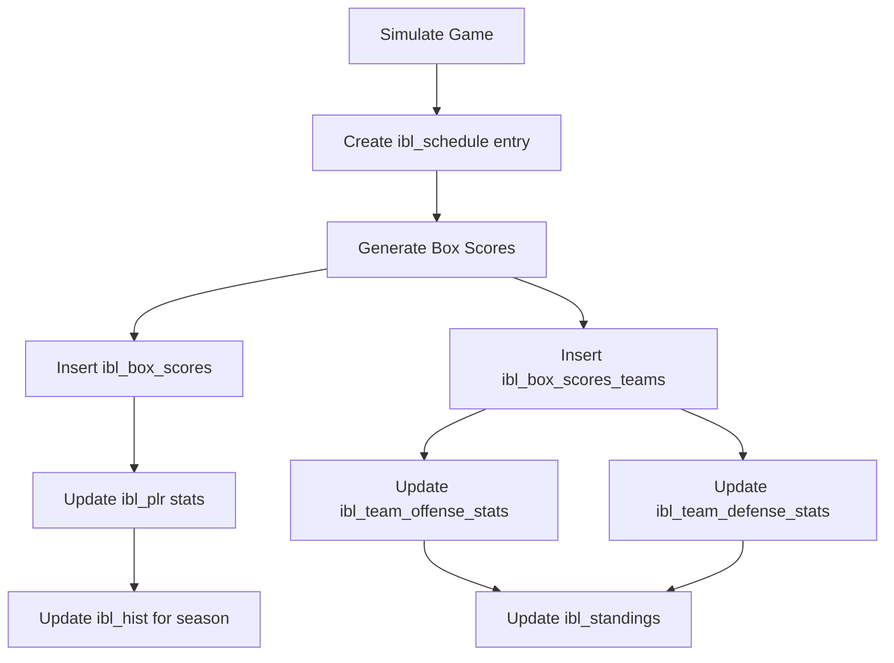

# Database Schema ER Diagram

This document provides entity-relationship diagrams for the IBL5 database schema.

## Core Entities Diagram



## Draft System Diagram



## Free Agency and Trading Diagram



## Statistics and Awards Diagram



## Voting System Diagram



## Key Relationships Summary

### Primary Entities

1. **ibl_team_info** (Teams)
   - Central entity for league teams
   - Referenced by: players, schedule, standings, stats, draft, trades, votes
   - Primary Key: `teamid`
   - Unique Key: `team_name`

2. **ibl_plr** (Players)
   - Central entity for player information
   - References: team (via `tid`)
   - Referenced by: history, box scores, stats, offers, awards
   - Primary Key: `pid`
   - Unique Key: `name`

3. **ibl_schedule** (Schedule)
   - Games and matchups
   - References: teams (visitor and home)
   - Referenced by: box scores
   - Primary Key: `SchedID`

### Relationship Cardinality

- **Team → Players**: One-to-Many (one team has many players)
- **Team → Schedule**: One-to-Many (one team plays many games)
- **Player → History**: One-to-Many (one player has many seasons)
- **Player → Box Scores**: One-to-Many (one player has many games)
- **Schedule → Box Scores**: One-to-Many (one game has many player performances)
- **Team → Standings**: One-to-One (one team has one current standing)

### Foreign Key Constraints (After Phase 2 Migration)

| Child Table | Column | Parent Table | Parent Column | On Delete | On Update |
|-------------|--------|--------------|---------------|-----------|-----------|
| ibl_plr | tid | ibl_team_info | teamid | RESTRICT | CASCADE |
| ibl_hist | pid | ibl_plr | pid | CASCADE | CASCADE |
| ibl_box_scores | pid | ibl_plr | pid | CASCADE | CASCADE |
| ibl_box_scores | visitorTID | ibl_team_info | teamid | RESTRICT | CASCADE |
| ibl_box_scores | homeTID | ibl_team_info | teamid | RESTRICT | CASCADE |
| ibl_schedule | Visitor | ibl_team_info | teamid | RESTRICT | CASCADE |
| ibl_schedule | Home | ibl_team_info | teamid | RESTRICT | CASCADE |
| ibl_standings | tid | ibl_team_info | teamid | CASCADE | CASCADE |
| ibl_draft | team | ibl_team_info | team_name | RESTRICT | CASCADE |
| ibl_fa_offers | name | ibl_plr | name | CASCADE | CASCADE |
| ibl_fa_offers | team | ibl_team_info | team_name | CASCADE | CASCADE |

## Indexes Overview

### Critical Indexes (Added in Phase 1)

**ibl_plr (Players)**
- `PRIMARY KEY (pid)`
- `KEY name (name)`
- `KEY teamname (teamname)`
- `KEY idx_tid (tid)` ← NEW
- `KEY idx_active (active)` ← NEW
- `KEY idx_retired (retired)` ← NEW
- `KEY idx_tid_active (tid, active)` ← NEW
- `KEY idx_pos (pos)` ← NEW

**ibl_hist (Player History)**
- `PRIMARY KEY (nuke_iblhist)`
- `UNIQUE KEY unique_composite_key (pid, name, year)`
- `KEY idx_pid_year (pid, year)` ← NEW
- `KEY idx_team_year (team, year)` ← NEW
- `KEY idx_year (year)` ← NEW

**ibl_schedule (Games)**
- `PRIMARY KEY (SchedID)`
- `KEY BoxID (BoxID)`
- `KEY idx_year (Year)` ← NEW
- `KEY idx_date (Date)` ← NEW
- `KEY idx_visitor (Visitor)` ← NEW
- `KEY idx_home (Home)` ← NEW
- `KEY idx_year_date (Year, Date)` ← NEW

**ibl_box_scores (Game Stats)**
- `KEY idx_date (Date)` ← NEW
- `KEY idx_pid (pid)` ← NEW
- `KEY idx_visitor_tid (visitorTID)` ← NEW
- `KEY idx_home_tid (homeTID)` ← NEW
- `KEY idx_date_pid (Date, pid)` ← NEW

## Common Query Patterns

### Get Team Roster
```sql
SELECT * FROM ibl_plr 
WHERE tid = ? AND active = 1
ORDER BY pos, ordinal;
-- Uses: idx_tid_active
```

### Get Player History
```sql
SELECT * FROM ibl_hist 
WHERE pid = ? AND year = ?;
-- Uses: idx_pid_year
```

### Get Team Schedule
```sql
SELECT * FROM ibl_schedule 
WHERE (Home = ? OR Visitor = ?) 
AND Year = ?
ORDER BY Date;
-- Uses: idx_home or idx_visitor, idx_year
```

### Get Daily Box Scores
```sql
SELECT bs.*, p.name, p.pos
FROM ibl_box_scores bs
INNER JOIN ibl_plr p ON bs.pid = p.pid
WHERE bs.Date = ?;
-- Uses: idx_date on box_scores, PRIMARY on plr
```

### Get Conference Standings
```sql
SELECT * FROM ibl_standings 
WHERE conference = 'Eastern'
ORDER BY pct DESC;
-- Uses: idx_conference
```

## Data Flow for Common Operations

### Player Trade Flow


### Game Simulation Flow


## Schema Evolution Considerations

### Short-term (After Phase 1 & 2)
- ✅ InnoDB for ACID transactions
- ✅ Foreign key integrity
- ✅ Performance indexes
- ✅ Audit timestamps

### Medium-term (Next 6 months)
- 📋 Add UUIDs for public API
- 📋 Create materialized views
- 📋 Normalize depth chart data
- 📋 Standardize naming conventions

### Long-term (Next 12 months)
- 📋 Partition large historical tables
- 📋 Separate read/write replicas
- 📋 Implement time-series for stats
- 📋 Archive old seasons

## Notes

1. **Mixed Identifier Types**: Some relationships use `name` (VARCHAR) instead of numeric IDs. Consider migrating to numeric IDs in future.

2. **Free Agents**: Players with `tid = 0` are free agents and don't reference a team.

3. **Legacy Tables**: PhpNuke tables (nuke_*) are not shown in these diagrams but exist in the schema.

4. **Compound Keys**: Some tables use composite keys (pid, name, year) which is redundant. Consider simplifying.

5. **Naming Consistency**: After Phase 2, consider standardizing all ID columns to follow `*_id` pattern.

## References

- Full schema: `ibl5/schema.sql`
- Improvements doc: `DATABASE_SCHEMA_IMPROVEMENTS.md`
- Migrations: `ibl5/migrations/`
- API Guide: `API_DEVELOPMENT_GUIDE.md`
