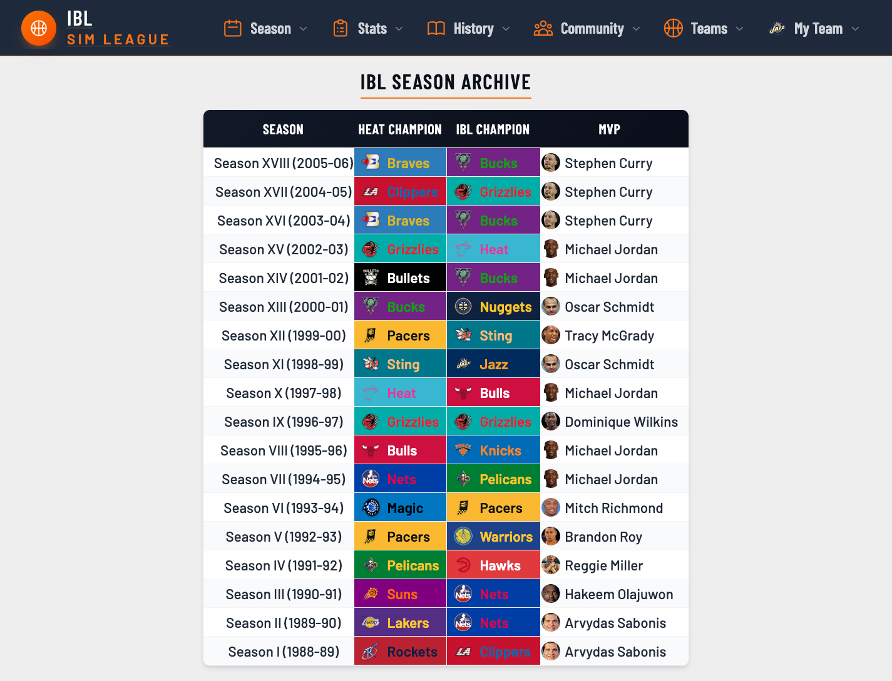

# IBL5 - Internet Basketball League

A fantasy basketball league website powered by the Jump Shot Basketball simulation engine. Managers draft, trade, and manage rosters of simulated players competing in a structured league season.



## Tech Stack

- **Backend:** PHP 8.4, MariaDB 10.11
- **Local Dev:** Docker (Apache/PHP + MariaDB 10.11)
- **Testing:** PHPUnit 13, PHPStan (level max + strict-rules + bleedingEdge), Playwright (E2E)
- **CI/CD:** GitHub Actions
- **Frontend:** Tailwind CSS 4, vanilla JS

## Quick Start

```bash
# 1. Clone and install
git clone git@github.com:a-jay85/IBL5.git && cd IBL5
cd ibl5 && composer install && cd ..

# 2. Start Docker (Apache/PHP + MariaDB)
docker compose up -d

# 3. Run tests (from ibl5/)
vendor/bin/phpunit
```

See [DOCKER_SETUP.md](ibl5/docs/DOCKER_SETUP.md) for detailed Docker setup and [DEVELOPMENT_ENVIRONMENT.md](ibl5/docs/DEVELOPMENT_ENVIRONMENT.md) for dependency caching.

## Project Structure

```
IBL5/
├── ibl5/
│   ├── classes/              # 77 modules (Repository/Service/View pattern)
│   │   ├── Waivers/          #   Canonical example (full RSV + Controller)
│   │   ├── Player/
│   │   ├── FreeAgency/
│   │   ├── Trading/
│   │   └── ...
│   ├── tests/                # PHPUnit + Playwright test suites
│   ├── docs/                 # Project documentation
│   ├── migrations/           # SQL migrations (000 = baseline schema)
│   ├── modules/              # Legacy PHP-Nuke entry points
│   ├── db/                   # Database connection setup
│   └── design/               # CSS source files (Tailwind)
├── bin/                      # Dev scripts (db-migrate, wt-new, etc.)
├── .claude/                  # Claude Code rules and skills
├── .github/                  # CI/CD workflows
└── CLAUDE.md                 # AI agent instructions
```

## Architecture

All modules use an **interface-driven Repository/Service/View** pattern:

```
Module/
├── Contracts/
│   ├── ModuleRepositoryInterface.php
│   ├── ModuleServiceInterface.php
│   └── ModuleViewInterface.php
├── ModuleRepository.php      # Database queries (prepared statements)
├── ModuleService.php         # Business logic, validation
└── ModuleView.php            # HTML rendering (XSS-protected)
```

See `ibl5/classes/Waivers/` for the canonical example (Repository, Service, Processor, Validator, View, Controller).

## Testing

```bash
# All commands below run from ibl5/

# Run all tests
vendor/bin/phpunit

# Run a specific module's tests
vendor/bin/phpunit --filter Player

# Run static analysis
composer run analyse

# Run E2E tests (requires Docker)
bun run test:e2e
```

**Current:** 4851 tests, 27370 assertions | PHPStan level max

## Documentation

All project documentation lives in [`ibl5/docs/`](ibl5/docs/README.md):

| Guide | Description |
|-------|-------------|
| [DEVELOPMENT_GUIDE.md](ibl5/docs/DEVELOPMENT_GUIDE.md) | Development standards and priorities |
| [DATABASE_GUIDE.md](ibl5/docs/DATABASE_GUIDE.md) | Schema reference and query patterns |
| [TESTING_STANDARDS.md](ibl5/docs/TESTING_STANDARDS.md) | Testing conventions and patterns |
| [DOCKER_SETUP.md](ibl5/docs/DOCKER_SETUP.md) | Docker environment setup |
| [REFACTORING_HISTORY.md](ibl5/docs/REFACTORING_HISTORY.md) | Complete module refactoring timeline |
| [STRATEGIC_PRIORITIES.md](ibl5/docs/STRATEGIC_PRIORITIES.md) | Post-refactoring roadmap |
| [DEVELOPMENT_ENVIRONMENT.md](ibl5/docs/DEVELOPMENT_ENVIRONMENT.md) | Dependency caching and dev tooling |

For AI agents, see [CLAUDE.md](CLAUDE.md).

## Current Status

| Metric | Value |
|--------|-------|
| Class modules | 77 |
| Tests | 4851 (27370 assertions) |
| Architecture | Interface-driven Repository/Service/View |
